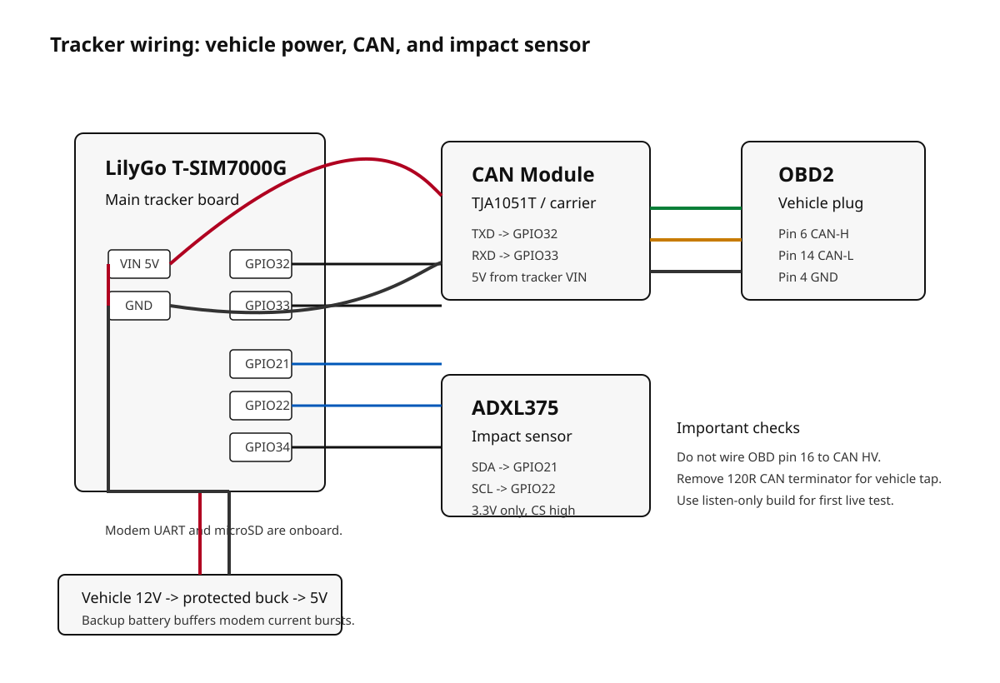
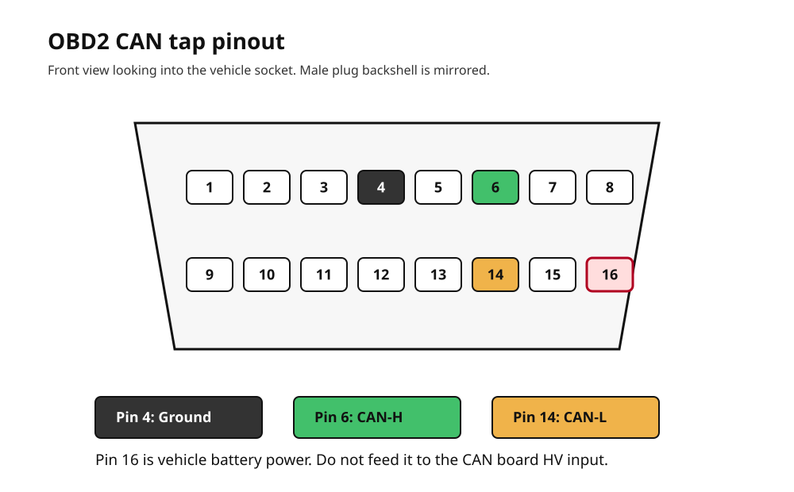
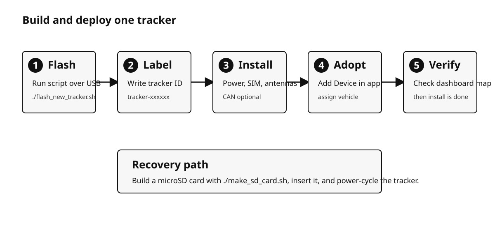

# Build One Tracker

This is the start-to-finish shop guide for one complete tracker.

## What you are building


The tracker lives in the vehicle, reads GPS and optional add-on hardware, sends
telemetry through the 1NCE SIM, and shows up in the dashboard/app.

## Parts

| Part | Why it is there |
|---|---|
| LilyGo T-SIM7000G | Main tracker board: ESP32, modem, SIM, GPS, USB flash, battery charger. |
| 1NCE SIM | Cellular data path. |
| GPS/LTE antennas | GNSS fix and cellular connection. |
| 12V to 5V buck | Vehicle power to tracker VIN. |
| LiPo or 18650 backup | Buffers modem current bursts and crank dips. |
| Optional CAN carrier / module | Reads OBD2 CAN data. |
| Optional ADXL375 | Impact/tamper sensor. |
| Case, labels, harness | Vehicle install hardware. |

## Wiring



Core tracker wiring:

| Function | Connection |
|---|---|
| Vehicle power | 12V input to protected 5V buck, then 5V to tracker VIN. |
| Ground | Vehicle ground to buck ground and tracker ground. |
| Modem UART | Already wired on the LilyGo board. |
| microSD recovery | Already wired on the LilyGo board. |
| GPS/LTE | Plug antennas into the LilyGo antenna connectors. |

Optional OBD2 wiring:



| OBD2 pin | Signal | Connect to |
|---|---|---|
| `4` | Ground | CAN module `G` |
| `6` | CAN-H | CAN module `H` |
| `14` | CAN-L | CAN module `L` |
| `16` | Battery 12V | Do not connect to the CAN board |

Optional add-on pins:

| Add-on | Tracker pins |
|---|---|
| CAN TX/RX | `GPIO 32` TX, `GPIO 33` RX |
| ADXL375 I2C | `GPIO 21` SDA, `GPIO 22` SCL |
| ADXL375 INT1 | `GPIO 34`, reserved |

## Flash and label



1. Plug in one tracker over USB.
2. Run `./flash_new_tracker.sh`.
3. Write the printed `tracker-xxxxxx` ID on the case.
4. Insert the SIM.
5. Power-cycle the tracker once after flashing.

## Install in the vehicle

1. Mount the tracker where the antennas can work.
2. Connect vehicle power through the 12V to 5V buck.
3. Connect the backup battery.
4. If using CAN, verify OBD2 pin `6`, `14`, and `4` before plugging in.
5. Power the tracker before plugging into OBD2.
6. Plug in with ignition off.

## Adopt in the app

1. Open `Devices`.
2. Tap `Add Device`.
3. Pick the tracker ID that matches the label.
4. Assign it to the vehicle.
5. Confirm the vehicle shows up on the dashboard map.

## Recovery

Use this when a tracker is already in the field and needs firmware without a
laptop.

```sh
./make_sd_card.sh /Volumes/YOURCARD
```

Then insert the card into the tracker and power-cycle it. The tracker flashes
the image, keeps its identity, and comes back as the same device.

## Quick checks

| Symptom | First thing to check |
|---|---|
| No telemetry | SIM active, antennas connected, tracker has power. |
| Shows offline | Wait for next heartbeat, then check cellular signal and power. |
| Brownout/reset behavior | Backup battery connected and healthy. |
| CAN not present | Confirm pins `6`, `14`, `4`, remove 120R termination, use listen-only first. |
| App cannot find tracker | Tracker is unadopted, nearby, and BLE advertising. |

