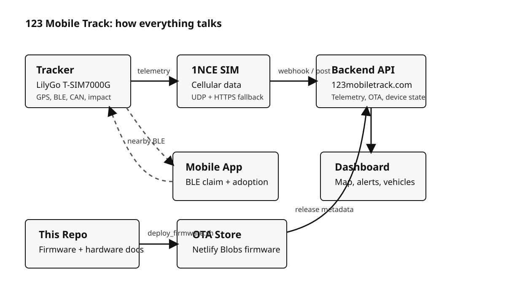

# Project Map

This repository is the firmware and deployment side of `123 Mobile Track`.
It does not contain the full web app source. The live dashboard and API are
hosted at `123mobiletrack.com`, and the firmware talks to that backend over
cellular.

## One-minute overview

## What lives where

| Piece | Where it lives | What it does |
|---|---|---|
| Firmware | `src/`, `include/`, `platformio.ini` | Runs on the tracker, reads sensors, talks to the modem, and posts telemetry. |
| Hardware carrier | `hardware/obd_tracker_carrier_v1/` | KiCad carrier-board design, BOM, placement file, and mechanical references. |
| App / dashboard | Separate app repo + `123mobiletrack.com` | Shows the map, vehicles, drivers, alerts, and device pages. |
| Telemetry backend | `123mobiletrack.com/api/fleet/*` | Receives tracker posts, serves OTA metadata, and drives device state. |
| OTA release store | Netlify Blobs via `deploy_firmware.sh` | Holds the current `.bin` plus version metadata. |
| Factory flash / recovery | `flash_new_tracker.sh`, `make_sd_card.sh` | Brings up a new board or field-recovers a board that cannot be reached over USB. |

## How the pieces talk to each other

1. The tracker boots, self-identifies, and reads GPS plus any optional add-on
   hardware that is present.
2. It sends telemetry to `123mobiletrack.com`.
3. The backend feeds the dashboard and app with live vehicle state.
4. The mobile app claims unadopted trackers over BLE.
5. Firmware releases are uploaded from this repo to the OTA store, then picked
   up by trackers on their next check-in.

## What this repo is for

- Building and flashing the tracker firmware.
- Keeping the carrier-board source and manufacturing references together.
- Publishing OTA releases.
- Re-flashing trackers in the field with microSD recovery cards.
- Documenting the tracker wiring and install process.
